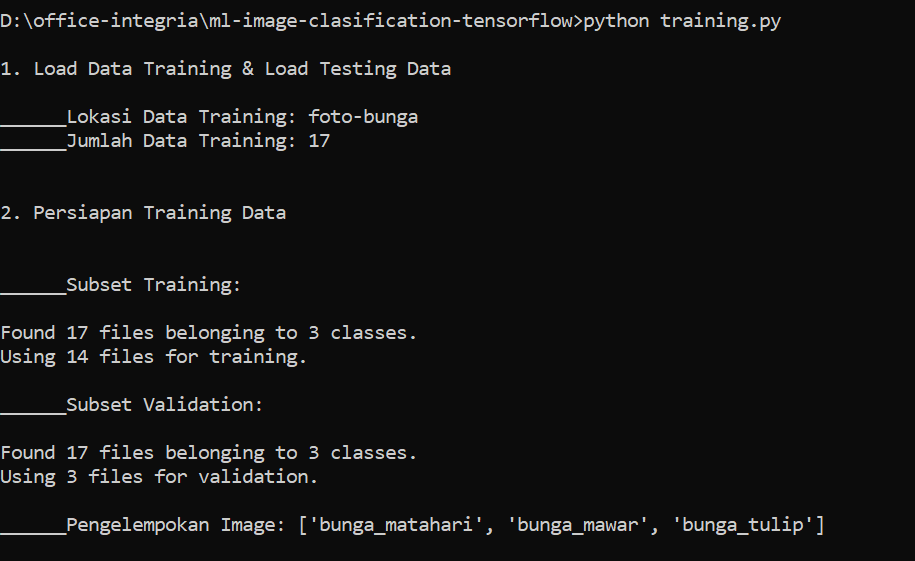
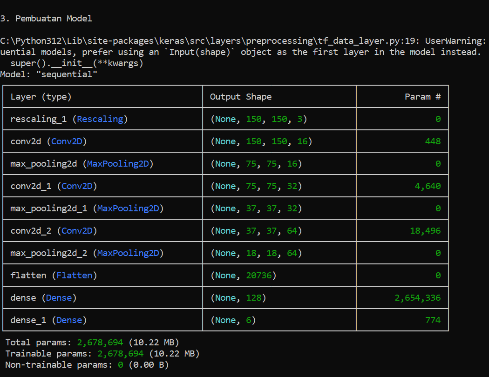
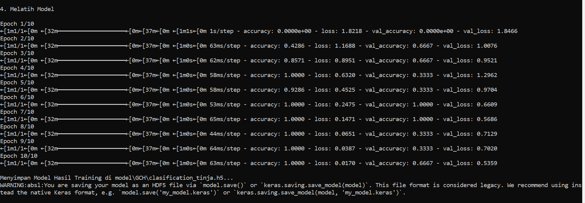
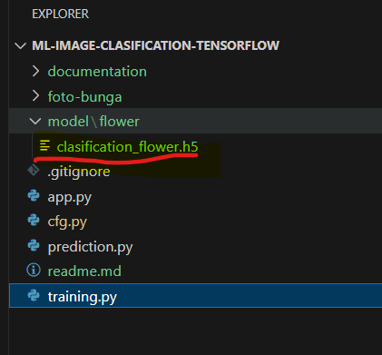
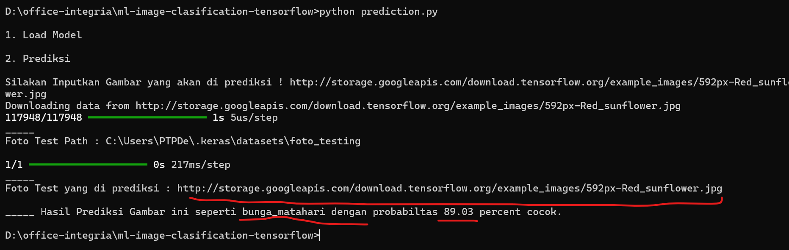
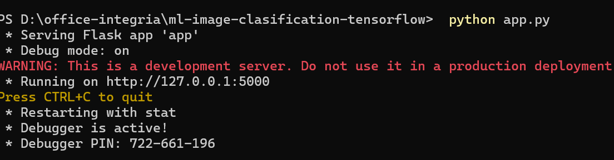
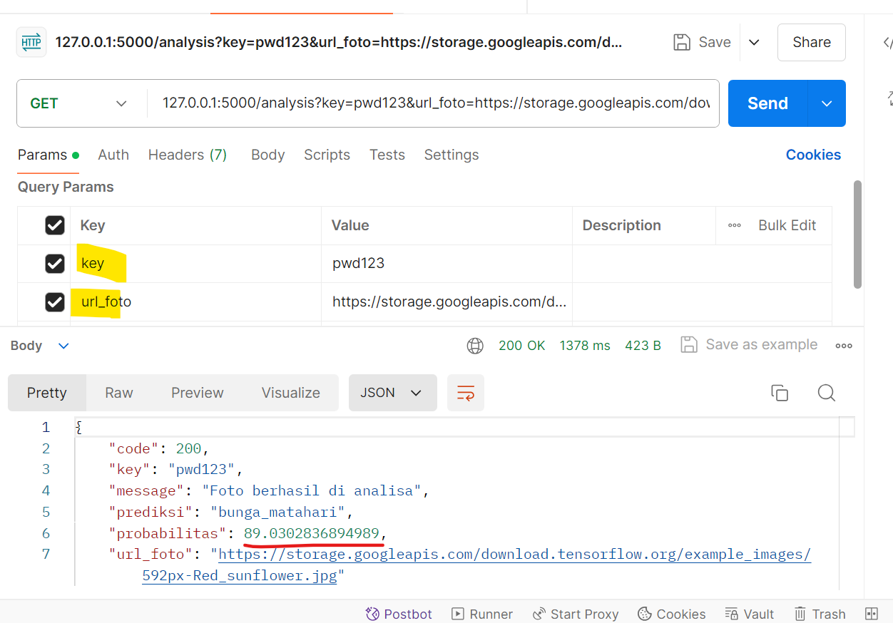

Mechine Learning Image Clasification using Tensorflow

# Introducting

Sebuah mechine learning untuk klasifikasi/mengkatagorikan foto, misalkan untuk mengetahui sebuah foto bunga 
yg di cek termasuk jenis bungan apa (exp: rose, tulip, ect)  

Mechine Learning menggunakan libaray Google Tensorflow

# Dependecy Modul 
- pip install requests
- pip install numpy
- pip install tensorflow
- pip install pathlib
- pip install image
- pip install flask
- pip install matplotlib

# Training Mechine Lenaring (Via Command Line) 
 python training.py

 command ini untuk melakukan training algoritma mechine learning agar dapat mengenail pola image 

Menghasil modeling hasil training bernama clasification_flower.h5

# Check Probaility Image Clasification (Via Command Line) 
 python prediction.py

 command ini untuk melakukan probabilitas sebuah image masuk kedalam sebuah image clasfication  

# Run API Server 

Di sediakan cara untuk Probaility Image Clasification melalui Rest API

Pilih satu cara di bawah ini 

untuk masuk ke enviroment
python -m venv env 

untuk masuk ke enviroment di windows 

env\Scripts\activate or env/bin/activate

untuk masuk ke enviroment linux
source env\Scripts\activate or env/bin/activate 
 

Run aplication api 

python app.py

untuk menjalan service di background atau menjadi daemon
nohop python app.py 

# Test Clasification Image Via API 

Beriku ini contoh cek  Probaility Image Clasification melalui Rest API

# Document Instalation

Instalasi Tenfosflow di Python
   -> https://www.tensorflow.org/install/pip

Materi Clasfikasi Image Tensor Flow
   -> https://www.tensorflow.org/tutorials/images/classification

Convert Online zip to tar.gz 
  -> https://anyconv.com/zip-to-tgz-converter/

Instalasi Microframework Pyhton Flask - Membuat API Service
  https://blog.javan.co.id/restful-api-sederhana-menggunakan-flask-dbb8fe9718d8 

# Firewall Open Port 
  
  Open Port 5000 for webserver python running default 

  sudo ufw allow from any to any port 5000 proto tcp